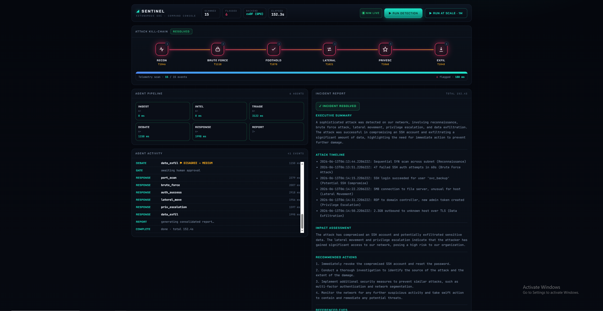
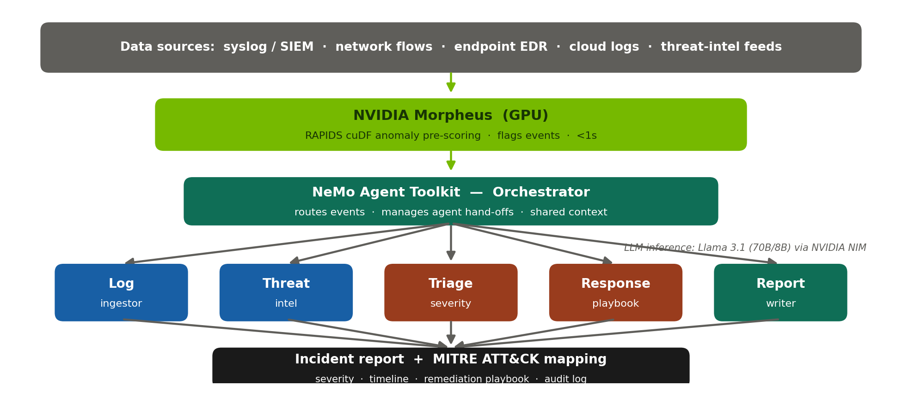
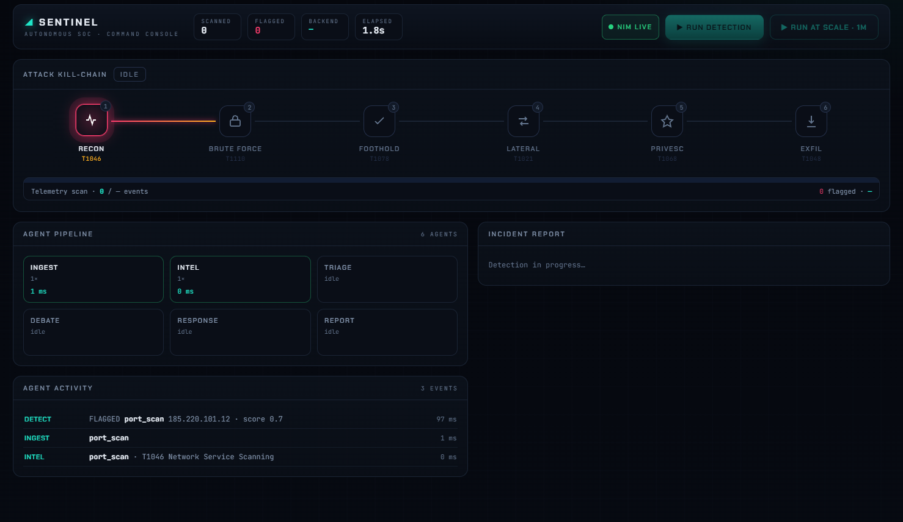
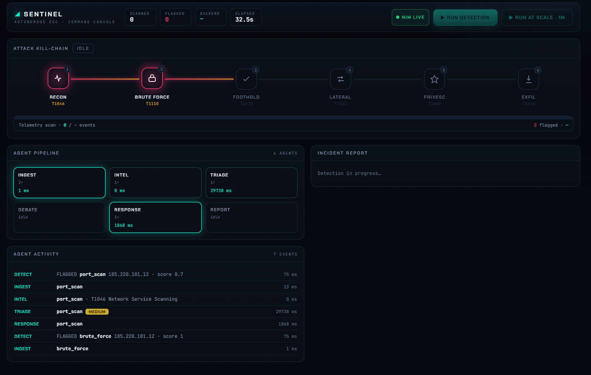
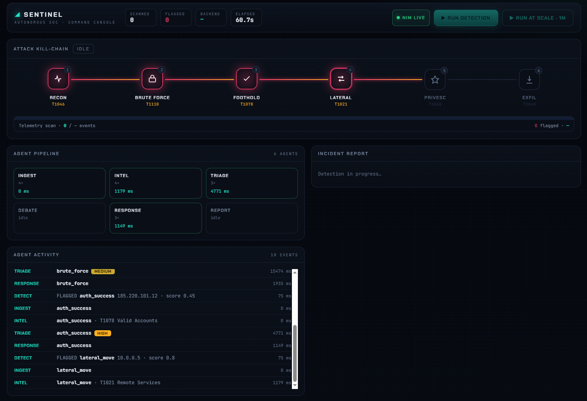
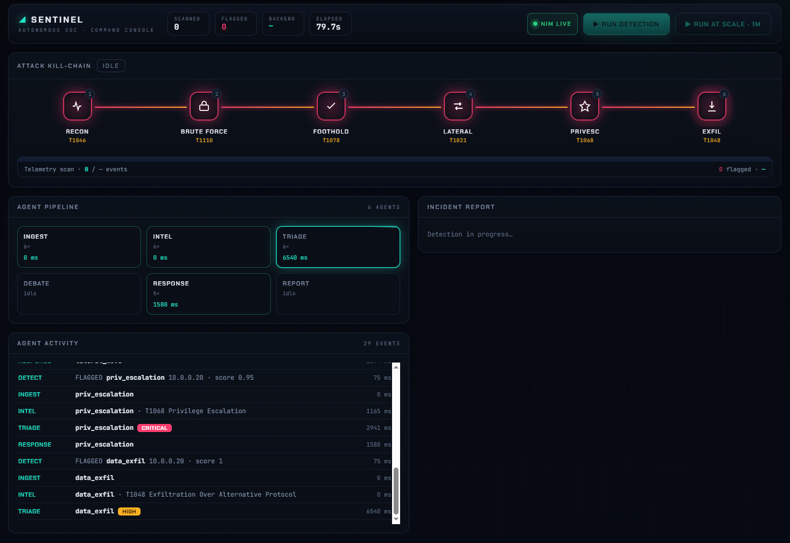

<div align="center">

# 🛡️ Autonomous SOC

### A GPU-tiered, multi-agent Security Operations Center

**The GPU scores millions of logs and flags the few that matter — a pipeline of LLM agents then triages, debates, and reports them, with a human in the loop before anything acts.**


<br/>



<sub><i>SENTINEL command console — a full recon→exfiltration intrusion detected, triaged, and reported.</i></sub>

</div>

---

## The problem

SOC analysts drown in alerts. Most are benign; the dangerous one is the needle in a haystack of millions of events. Triaging each by hand — *is this real? what's the blast radius? what do I do?* — takes minutes to hours, and the alert that gets missed is the one that hurts.

You can't fix this by pointing an LLM at the firehose: a million events won't fit in a context window, and the cost and latency would be absurd. **So we tier the compute.**

## How it works

A cheap, vectorised **GPU pass scores every event** and flags only the anomalous few. Those — and *only* those — flow into an **agent pipeline** that reasons about them. Detection scales to millions; expensive reasoning only ever touches the handful that matter.

<div align="center">

</div>

1. **GPU scoring (NVIDIA Morpheus / RAPIDS cuDF)** — every log event is scored for anomaly on the GPU in a single vectorised pass. A million events → seconds → a few flagged.
2. **Agent pipeline (NVIDIA NIM · Llama 3.1)** — each flagged event is enriched with threat intel, triaged for severity, and *debated* by a second agent that can disagree and escalate.
3. **Human-in-the-loop gate** — the run pauses. No response action executes until an analyst clicks **Approve**.
4. **Response + report** — on approval, agents draft a containment playbook and a consolidated incident report mapped to MITRE ATT&CK.

Every step is streamed live to the dashboard over Server-Sent Events.

## See it in action

The kill-chain reconstructs a six-stage attack as the agents work through the flagged events:

<table>
<tr>
<td width="50%"><br/><sub><b>1 · Recon flagged</b> — the run begins; a port scan from an external IP trips the first node.</sub></td>
<td width="50%"><br/><sub><b>2 · Brute force</b> — SSH password-guessing from the same source escalates.</sub></td>
</tr>
<tr>
<td width="50%"><br/><sub><b>3 · Foothold + lateral</b> — a successful login (HIGH) pivots into SMB lateral movement.</sub></td>
<td width="50%"><br/><sub><b>4 · Full chain</b> — privilege escalation (CRITICAL) and data exfiltration complete the picture.</sub></td>
</tr>
</table>

## The six agents

| # | Agent | Engine | What it does |
|---|-------|--------|--------------|
| 1 | **Log Ingestor** | deterministic | Structures and normalises the flagged event (no LLM — it's already structured) |
| 2 | **Threat Intel** | rules + NIST NVD API | Maps to a MITRE ATT&CK technique and pulls live related CVEs |
| 3 | **Triage** | Llama 3.1 **70B** | Classifies severity, attack type, and confidence |
| 4 | **Review / Debate** | Llama 3.1 **8B** | Independent second opinion — can disagree and escalate; escalation wins |
| ⏸ | **Human approval gate** | — | Pipeline pauses; nothing acts without an analyst's approval |
| 5 | **Response** | Llama 3.1 **8B** | Drafts a containment & remediation playbook |
| 6 | **Report Writer** | Llama 3.1 **70B** | Consolidated incident report with timeline, impact, and MITRE map |

Right-sizing the models (8B for fast classification, 70B only where nuance matters) and keeping deterministic work off the LLM keeps an end-to-end run to roughly a minute.

## Tech stack

- **GPU compute** — NVIDIA Morpheus / RAPIDS **cuDF** for vectorised log scoring
- **LLM inference** — **NVIDIA NIM** serving **Llama 3.1 8B & 70B**
- **Agent orchestration** — NeMo Agent Toolkit pattern (shared-context hand-offs)
- **Service + streaming** — **FastAPI** with **Server-Sent Events**
- **Dashboard** — single-file vanilla JS command console (no build step)
- **Threat intel** — live **NIST NVD** CVE API (public domain)
- **Deployment** — Debian `.deb` + systemd unit for on-prem Linux, running inside the Morpheus container

## Quickstart

> cuDF needs a GPU, so run inside an NVIDIA Morpheus / RAPIDS container.

```bash
# 1. Install dependencies
pip install -r requirements.txt

# 2. Add your NIM key
cp .env.example .env        # then set NVIDIA_API_KEY

# 3. Generate synthetic logs
python log_generator.py             # ~16-event demo (attack chain + noise)
python log_generator.py 1000000     # 1,000,000-event scale set

# 4. Run the service
uvicorn orchestrator:app --port 8080 --reload
```

Open **http://127.0.0.1:8080**, click **Run detection**, watch the kill-chain light up, approve at the gate, and read the generated report. Hit **Run at scale · 1M** to score a million events and watch it isolate the six that matter.

## GPU benchmark

The same scoring kernel runs on the GPU (cuDF) and the CPU (pandas) over millions of rows — cuDF scores the whole batch in milliseconds while the CPU pass takes seconds. Run it from the command line or live from the dashboard's **Run benchmark** button:

```bash
python benchmark/benchmark.py 2000000
```

The benchmark reports real measured times on your hardware — it never prints a GPU number unless a GPU is actually present.

## How detection works (under the hood)

Each event gets a transparent, fast anomaly score: an event-type base weight, plus bumps for external/known-bad source IPs and sensitive ports (SSH, RDP, SMB…), thresholded to flag the suspicious few. The pivotal *successful login* — quiet on its own — is caught three ways: tuned scoring lifts it over the threshold, the triage prompt knows a successful external login after failures means compromise, and the debate agent escalates it in context. That layered catch of the one event that matters is the heart of the system.

## Roadmap

- Train a learned Morpheus anomaly model (digital fingerprinting) and serve it on Triton, replacing the heuristic first pass
- Real log-source connectors (SIEM / EDR / cloud) in place of synthetic data
- Parallelise agent calls to cut end-to-end latency
- Multi-GPU streaming ingestion for higher throughput

## Acknowledgements

Built for the **NVIDIA India Agentic AI Open Hackathon** (Track A — Agentic Workflows), on NVIDIA Morpheus, NIM, and the NeMo Agent Toolkit. MITRE ATT&CK technique mappings and NIST NVD data are used under their public terms.

---

<div align="center">
<sub>Detection scales on the GPU. Reasoning is reserved for what matters. A human stays in control.</sub>
</div>
